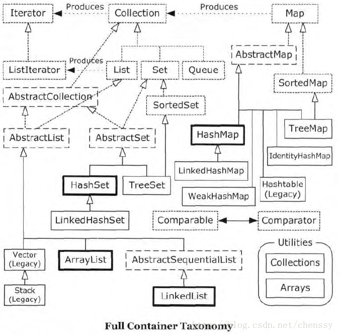
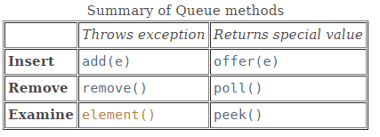
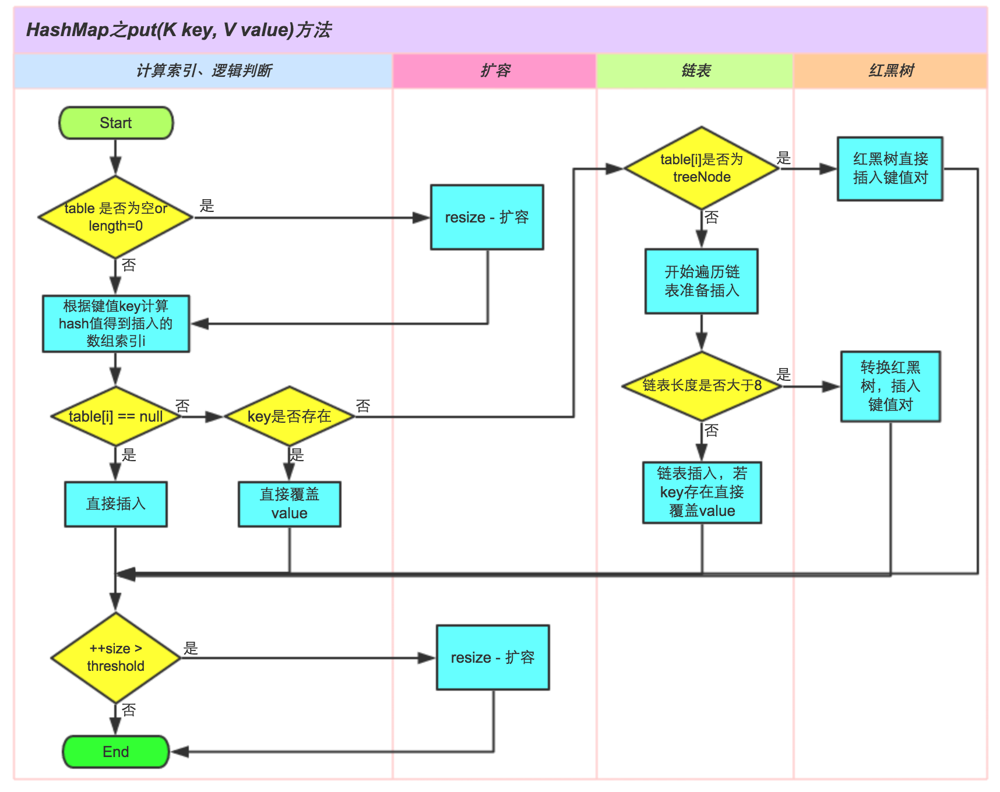

#### 容器源码学习，总结自https://blog.csdn.net/u011240877
### 集合关系图

### Iterator
* 在调用迭代器的 next,remove 方法时都会比较 expectedModCount 和 modCount 是否相等,如果不相等就会抛出 ConcurrentModificationException ,也就是成为了 fail-fast.
* 用 CopyOnWriteArrayList,ConcurrentHashMap 替换 ArrayList, HashMap,它们的功能和名字一样,在写入时会创建一个 copy,然后在这个 copy 版本上进行修改操作,这样就不会影响原来的迭代.不过坏处就是浪费内存.
* Iterator iterator = list.iterator();
      while (iterator.hasNext()){
          System.out.println(iterator.next());
      }
#### ListIterator

多了向前的几个方法
### Collection
* boolean retainAll(Collection<?> c) 
  求交集，保留本集合中 c 集合中两者共有的,如果集合有改变就返回 true
* Object[] toArray() 
  返回一个包含集合中所有元素的数组
* <T> T[] toArray(T[] a)
  返回一个包含集合中所有元素的数组,运行时根据集合元素的类型指定数组的类型
### List
* 一个 List 是一个元素有序的、可以重复、可以为 null 的集合（有时候我们也叫它“序列”）.
* indexOf, lastIndexOf 
  返回指定元素在 list 中的首次出现/最后一次出现的位置（获取 lastIndexOf 是通过倒序遍历查找）;
* List.subList(int fromIndex, int toIndex) 方法返回 List 在 fromIndex 与 toIndex 范围内的子集.注意是左闭右开,[fromIndex,toIndex).返回的仍是原来List的引用.
### AbstractCollection
* 相较Collection实现了大部分方法,除了iterator()和size()
* 构造方法是protected的,所以子类继承最好实现自己的无参构造方法.
* add(E)方法会报 UnsupportedOperationException 异常
### AbstractList
* AbstractList 继承自 AbstractCollection 抽象类,实现了 List 接口 ,是 ArrayList 和 AbstractSequentiaList 的父类.
* 子类必须要实现 get(), size() 方法,还需要重写 add(), set(), remove() 方法,否则会报 UnsupportedOperationException 错.
### ArrayList
* 优点:容量不固定,可扩容;有序;元素能为null;
效率高,size(), isEmpty(), get(), set() iterator(), ListIterator() 方法的时间复杂度都是 O(1),add() 添加操作的时间复杂度平均为 O(n),其他所有操作的时间复杂度几乎都是 O(n);
占用空间小,对比 LinkedList,不用占用额外空间维护链表结构.
* ArrayList 继承自 RandomAccess， 而且它的迭代器都是基于 ArrayList 的方法和数组直接操作，所以遍历时 get 的效率要 >= 迭代器。
* 非同步，fail-fast
* 扩容大小大于当前1.5倍，取扩容的值，否则取1.5倍当前大小。
### AbstractSequentialList
* 不通过get取元素，而是通过迭代器
### Queue
* FIFO
* 循环队列 rear = (rear - size) % size，放满条件 (rear - front) % size = -1，rear + size - font
* 
* offer在容量满时返回false，而add抛异常；poll在空是返回null，remove抛异常
* 禁止添加 null 元素，但有些实现类没响应，例如LinkedList。
### Deque
* 双端队列，两边都能插入删除。
* 
* 继承了queue的方法
* 也能作为stack，LIFO,push(e),pop(),peek().
### LinkedList
* 双向链表，有序，允许元素为 null
* ArrayList
基于数组，在数组中搜索和读取数据是很快的。因此 ArrayList 获取数据的时间复杂度是O(1);
但是添加、删除时该元素后面的所有元素都要移动，所以添加/删除数据效率不高；
另外其实还是有容量的，每次达到阈值需要扩容，这个操作比较影响效率。
* LinkedList
基于双端链表，添加/删除元素只会影响周围的两个节点，开销很低；
只能顺序遍历，无法按照索引获得元素，因此查询效率不高；
没有固定容量，不需要扩容；
需要更多的内存，如文章开头图片所示 LinkedList 每个节点中需要多存储前后节点的信息，占用空间更多些。
### Vector
Vector VS ArrayList
* 共同点：
都是基于数组
都支持随机访问
默认容量都是 10
都有扩容机制
* 区别：
Vector 出生的比较早，JDK 1.0 就出生了，ArrayList JDK 1.2 才出来
Vector 比 ArrayList 多一种迭代器 Enumeration
Vector 是线程安全的，ArrayList 不是
Vector 默认扩容 2 倍，ArrayList 是 1.5
### Stack
* 继承自Vector,LIFO,采用数组实现,也能用链表实现
* push(),pop(),peek()
### Map
* key-value对
* KeySet,Values,Entry
* 通过 Map.entrySet() 方法获得的是一组 Entry 的集合，保存在 Set 中，所以 Map 中的 Entry 也不能重复。
  public Set<Map.Entry<K,V>> entrySet();
* 3种遍历
```
Set set = map.keySet();
    for (Object key : set) {
        System.out.println(map.get(key));
    }
    
Collection values = map.values();
Iterator iterator = values.iterator();
while (iterator.hasNext()){
    System.out.println("value " + iterator.next());
}

Set entrySet = map.entrySet();
for (Object o : entrySet) {
    Map.Entry entry = (Map.Entry) o;
    System.out.println(entry);      //key=value
    System.out.println(entry.getKey() + " / " + entry.getValue());
}
```
* 实现类：Hashtable 古老，线程安全;HashMap：速度快，无序；TreeMap:有序，效率低；LinkedHashMap:结合 HashMap 和 TreeMap 的优点，有序的同时效率也不错，仅比 HashMap 慢一点
### Hash
* 哈希 其实是随机存储的一种优化，先进行分类，然后查找时按照这个对象的分类去找。
* 链接法,将所有关键字为同义词的结点链接在同一个单链表中。开放定址法,包括线性探查法(适用稀疏表)，双重散列法,hi=(h(key)+i*h1(key)) ％ m，0 ≤ i ≤ m-1,h1(key) 的值和 m 互素
* 在哈希表上的插入、查找、删除等操作的时间复杂度是 O(1)
* HashMap 中的加载因子为 0.75

### AbstractMap
* 唯一的抽象方法：public abstract Set<Entry<K,V>> entrySet();
* 不可变

### HashMap
* 数组+链表
* 底层实现是 链表数组，JDK 8 后又加了 红黑树
* 实现了 Map 全部的方法
* key 用 Set 存放，所以想做到 key 不允许重复，key 对应的类需要重写 hashCode 和 equals 方法
* 允许空键和空值（但空键只有一个，且放在第一位，下面会介绍）
* 元素是无序的，而且顺序会不定时改变
* 插入、获取的时间复杂度基本是 O(1)（前提是有适当的哈希函数，让元素分布在均匀的位置）
* 遍历整个 Map 需要的时间与 桶(数组) 的长度成正比（因此初始化时 HashMap 的容量不宜太大）
* 两个关键因子：初始容量(默认16,必须是 2 的整数次方)、加载因子(0.75)
* fail-fast机制
* 当桶数量不大于8时采用数组，超过后采用树(JDK1.8特性)
* Hashtable 不允许null 且是同步的
* hash值高低16位共同参与运算，散列更加均衡。return (key == null) ? 0 : (h = key.hashCode()) ^ (h >>> 16);
* 插入逻辑

  1. 先调用 hash() 方法计算哈希值
  2. 然后调用 putVal() 方法中根据哈希值进行相关操作
  3. 如果当前 哈希表内容为空，新建一个哈希表
  4. 如果要插入的桶中没有元素，新建个节点并放进去
  5. 否则从桶中第一个元素开始查找哈希值对应位置 
  6. 如果桶中第一个元素的哈希值和要添加的一样，替换，结束查找
  7. 如果第一个元素不一样，而且当前采用的还是 JDK 8 以后的树形节点，调用 putTreeVal() 进行插入
  8. 否则还是从传统的链表数组中查找、替换，结束查找
  9. 当这个桶内链表个数大于等于 8，就要调用 treeifyBin() 方法进行树形化
  10. 最后检查是否需要扩容
* 扩容逻辑，超出阈值就会扩容
  1. 新初始化哈希表时，容量为默认容量，阈值为 容量*加载因子
  2. 已有哈希表扩容时，容量、阈值均翻倍
  3. 如果之前这个桶的节点类型是树，需要把新哈希表里当前桶也变成树形结构
  4. 复制给新哈希表中需要重新索引（rehash），这里采用的计算方法是 
     e.hash & (newCap - 1)，等价于 e.hash % newCap
* 查找逻辑
  1. 先计算哈希值;
  2. 然后再用 (n - 1) & hash 计算出桶的位置;
  3. 在桶里的链表进行遍历查找。
* jdk1.8引入红黑树,优化链表元素多的时候查找性能,扩充阈值8，缩小阈值6
### HashTable
* 同步的HashMap，线程安全，效率不高
### CopyOnWriteArrayList
* Copy-On-Write机制：读写分离，修改时copy一个容器进行修改，修改完指向新的容器，可以并发读而不用加锁
* 写的时候加ReentrantLock,防止多线程copy出多个副本
* 应用场景：读多写少的并发场景，白名单，黑名单，商品类目的访问和更新场景
* 存在的问题：内存占用问题（压缩或者使用其他并发容器，如ConcurrentHashMap;数据一致性：属于最终一致性，不是实时一致性，不适用于需要实时读取的场景。
### Collections.SynchronizedList(List list)
* List的包装类 除了Iterator的操作没有加锁，其他都加了锁
* 适用于在写多的安全场景中
* 与Vector区别： 
    1. SynchronizedList有很好的扩展和兼容功能。他可以将所有的List的子类转成线程安全的类。 
    2. 使用SynchronizedList的时候，进行遍历时要手动进行同步处理。
    3. SynchronizedList可以指定锁定的对象。
### LinkedHashMap
* 有序的,相比HashMap添加了一个链表用来维护顺序
* 标志位accessOrder (值为true时，表示按照访问顺序迭代；值为false时，表示按照插入顺序迭代)。
* 当accessOrder为true时，可以用来实现LRU(LAST RECENTLY USED)算法

### TreeMap
* 有序 且key是自然排序的
//TODO 红黑树

### ConcurrentHashMap
#### jdk1.7实现
* 分段锁，分成16(默认)个槽(segment)，每次操作只对对应的槽加锁
* 写入：
    1. 先计算hash值，找到segment位置，然后在相应segment 写入；
    2. 写入加独占锁，其余操作参考hashmap
#### jdk1.8实现
* https://blog.csdn.net/bill_xiang_/article/details/81122044
* 类似HashMap的实现 有一个链表数组 
* put时 如果hash计算后对应的Node存在，则对该Node加锁，大于8触发红黑树转换，添加完元素后解锁
* size计算 baseCount + sum(CounterCell)
* 通过缩小锁粒度来提高并发性能
### ConcurrentSkipListMap
* 线程安全 有序 key 自然顺序
* 空间换时间 插入 读取 O(logn)

### HashSet
* 底层就是个HashMap，用key存储元素,同理LinkedHashSet,TreeSet等

### ArrayQueue
* 数组存储，循环队列

### PriorityQueue 
* 基于堆实现

### PriorityBlockingQueue

### DelayQueue

### ArrayBlockingQueue

### LinkedBlockingQueue

### Stack