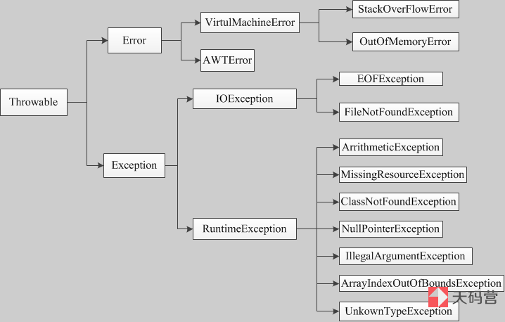

###异常体系结构

Java把异常当作对象来处理，并定义一个基类java.lang.Throwable作为所有异常的超类。
* Error和Exception的区别：Error通常是灾难性的致命的错误，是程序无法控制和处理的，
当出现这些异常时，Java虚拟机（JVM）一般会选择终止线程；
Exception通常情况下是可以被程序处理的，并且在程序中应该尽可能的去处理这些异常。
* runtimeException 不受检查的异常，程序可以不作处理，而其他异常需要程序try-catch捕获
或者throws抛出
* 多重catch，依次检查，第一个匹配的执行，其他旁路
* finally子句是可选项，可以有也可以无，但是每个try语句至少需要一个catch或者finally子句，
如果finally块与一个try联合使用，finally块将在try结束之前执行
* finally 中return会覆盖掉原来的return，且在finally中使用reutrn会丢失所有异常
* RUNTIMEEXCEPTION 才会让事务回滚