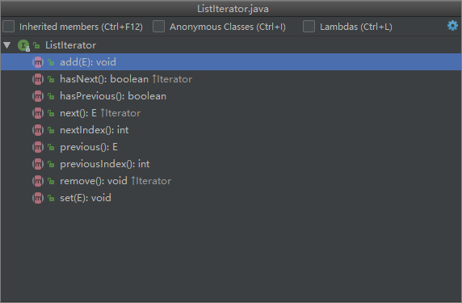

####总结自https://blog.csdn.net/u011240877
###集合关系图

###Iterator
* 在调用迭代器的 next,remove 方法时都会比较 expectedModCount 和 modCount 是否相等,如果不相等就会抛出 ConcurrentModificationException ,也就是成为了 fail-fast.
* 用 CopyOnWriteArrayList,ConcurrentHashMap 替换 ArrayList, HashMap,它们的功能和名字一样,在写入时会创建一个 copy,然后在这个 copy 版本上进行修改操作,这样就不会影响原来的迭代.不过坏处就是浪费内存.
* Iterator iterator = list.iterator();
      while (iterator.hasNext()){
          System.out.println(iterator.next());
      }
####ListIterator

多了向前的几个方法
###Collection
* boolean retainAll(Collection<?> c) 
  保留本集合中 c 集合中两者共有的,如果集合有改变就返回 true
* Object[] toArray() 
  返回一个包含集合中所有元素的数组
* <T> T[] toArray(T[] a)
  返回一个包含集合中所有元素的数组,运行时根据集合元素的类型指定数组的类型
###List
* 一个 List 是一个元素有序的、可以重复、可以为 null 的集合（有时候我们也叫它“序列”）.
* indexOf, lastIndexOf 
  返回指定元素在 list 中的首次出现/最后一次出现的位置（获取 lastIndexOf 是通过倒序遍历查找）;
* List.subList(int fromIndex, int toIndex) 方法返回 List 在 fromIndex 与 toIndex 范围内的子集.注意是左闭右开,[fromIndex,toIndex).返回的仍是原来List的引用.
###AbstractCollection
* 相较Collection实现了大部分方法,除了iterator()和size()
* 构造方法是protected的,所以子类继承最好实现自己的无参构造方法.
* add(E)方法会报 UnsupportedOperationException 异常
###AbstractList
* AbstractList 继承自 AbstractCollection 抽象类,实现了 List 接口 ,是 ArrayList 和 AbstractSequentiaList 的父类.
* 子类必须要实现 get(), size() 方法,还需要重写 add(), set(), remove() 方法,否则会报 UnsupportedOperationException 错.
###ArrayList
* 优点:容量不固定,可扩容;有序;元素能为null;
效率高,size(), isEmpty(), get(), set() iterator(), ListIterator() 方法的时间复杂度都是 O(1),add() 添加操作的时间复杂度平均为 O(n),其他所有操作的时间复杂度几乎都是 O(n);
占用空间小,对比 LinkedList,不用占用额外空间维护链表结构.
* ArrayList 继承自 RandomAccess， 而且它的迭代器都是基于 ArrayList 的方法和数组直接操作，所以遍历时 get 的效率要 >= 迭代器。
* 非同步，fail-fast
* 扩容大小大于当前1.5倍，取扩容的值，否则取1.5倍当前大小。
###AbstractSequentialList
* 不通过get取元素，而是通过迭代器
###Queue
test
